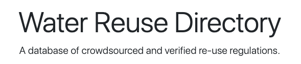

## About This Project

This project was developed by the Winter-Spring 2020 Capstone team, consisting of: 

- Dmitri Murphy 
- Tyler Race
- Davis Giang 
- Alexander Wallace 
- Paul Hubbard 
- Jubal Gonzalez-Santos
- Steven Schulze

## How to Run the Project Locally

Instruction here... 

## About Laravel (framework used for this project)

Laravel is a web application framework with expressive, elegant syntax. We believe development must be an enjoyable and creative experience to be truly fulfilling. Laravel takes the pain out of development by easing common tasks used in many web projects. Laravel is accessible, powerful, and provides tools required for large, robust applications.

## Learning Laravel

Laravel has the most extensive and thorough [documentation](https://laravel.com/docs) and video tutorial library of all modern web application frameworks, making it a breeze to get started with the framework.

If you don't feel like reading, [Laracasts](https://laracasts.com) can help. Laracasts contains over 1500 video tutorials on a range of topics including Laravel, modern PHP, unit testing, and JavaScript. Boost your skills by digging into our comprehensive video library.

## Contributing

Please contact Recode [here](https://www.recodenow.org/contact-us/) if you would like to contribute to this project.

## License

This code is licensed under the [MIT license](https://opensource.org/licenses/MIT).
